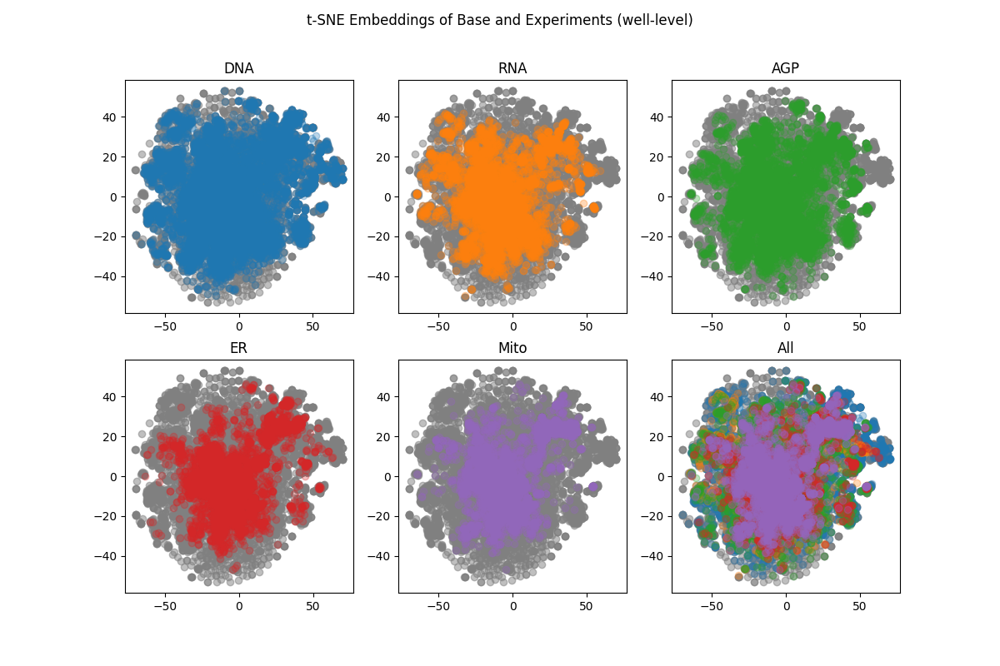
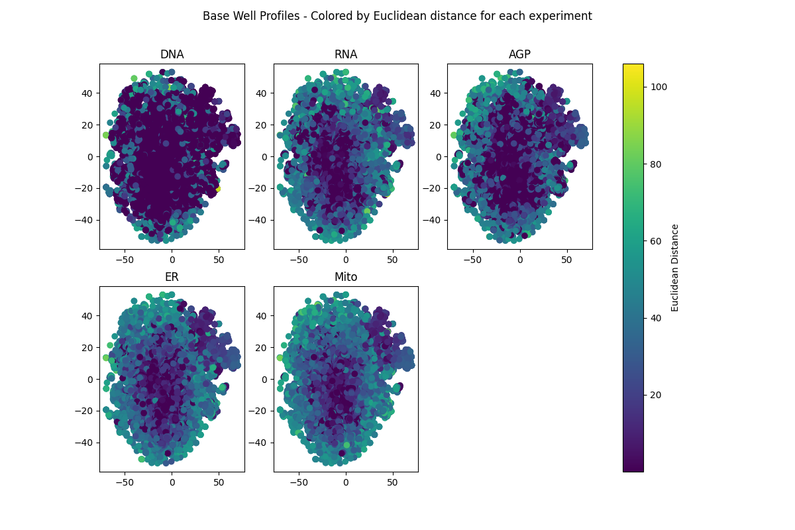
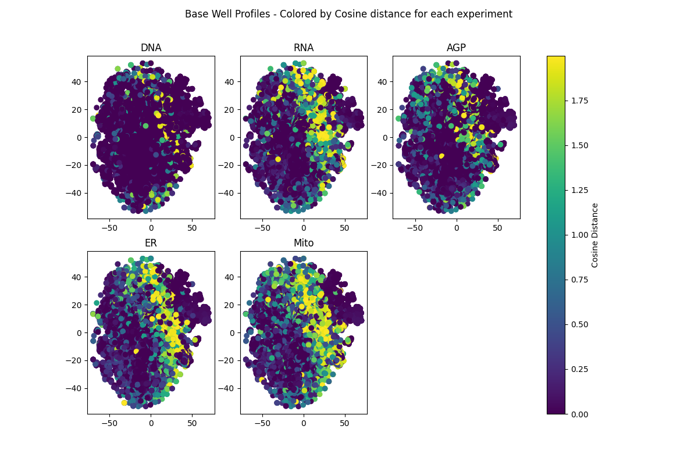
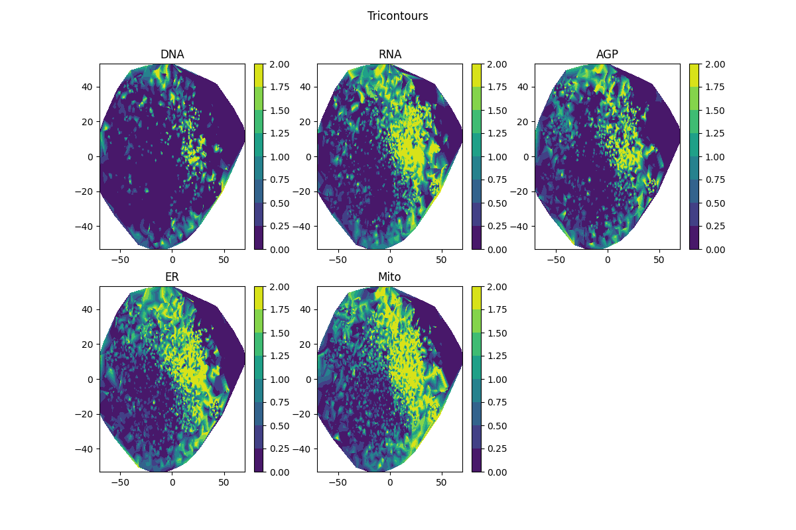
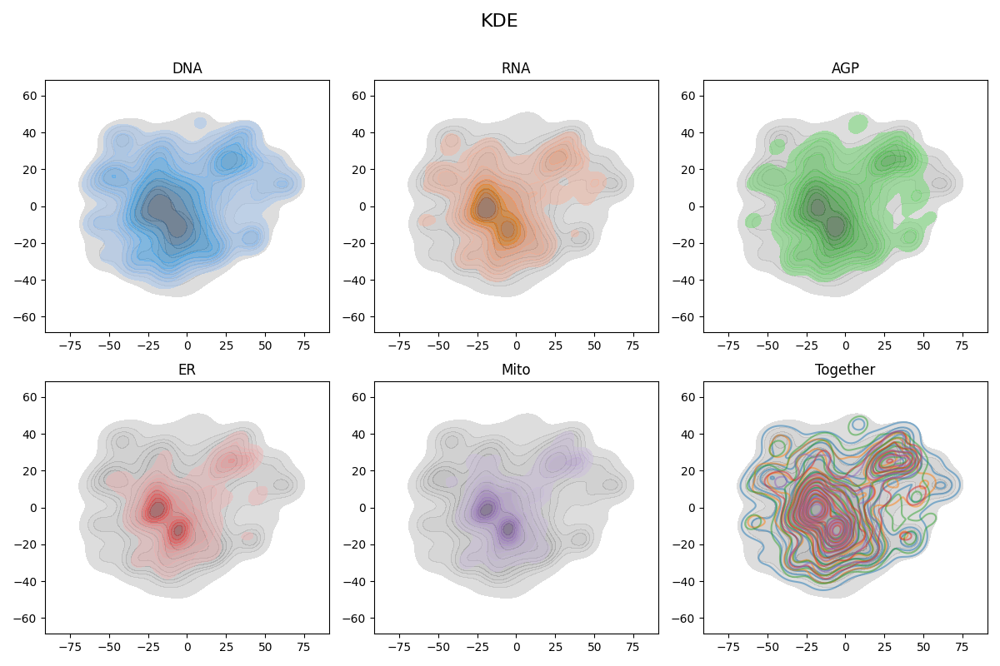
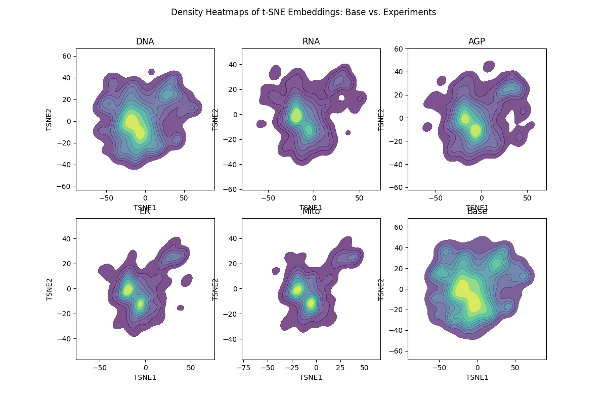
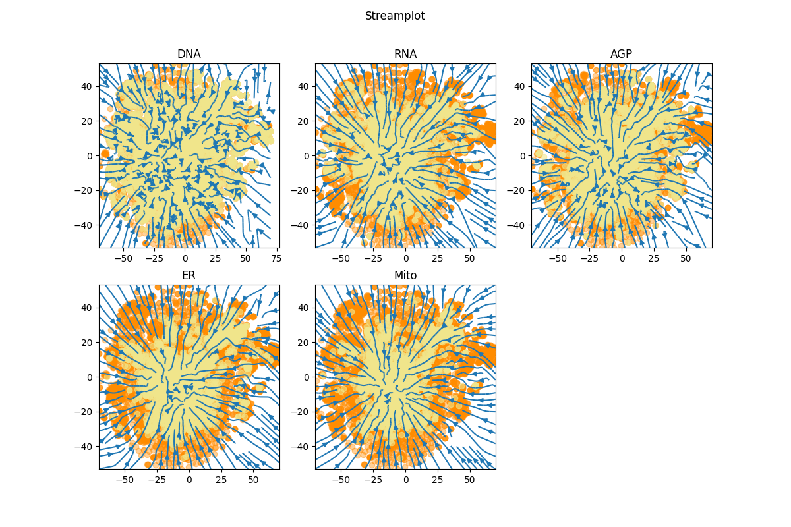
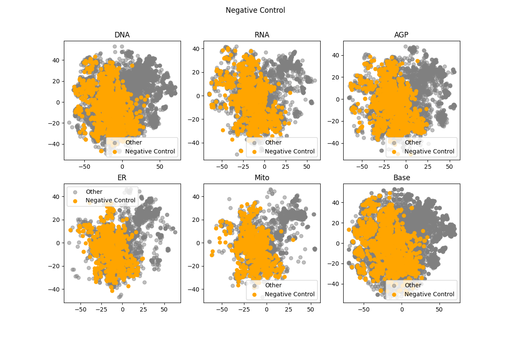
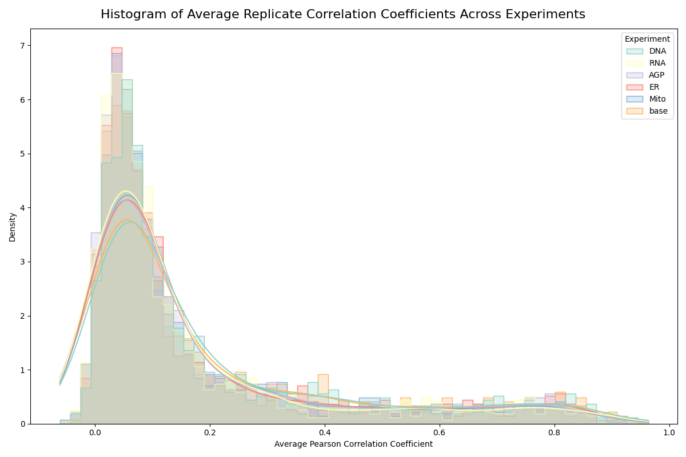
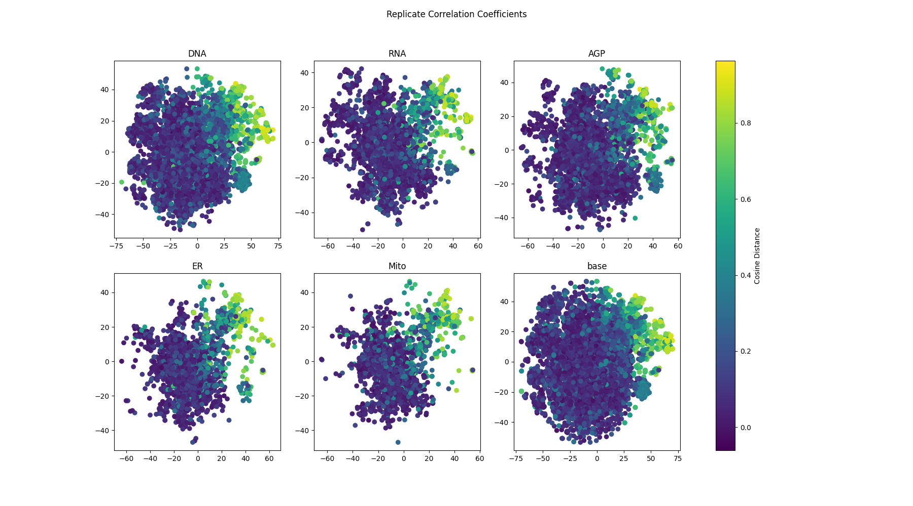

# BBBC022 - Posamičen kanal je mean povprečen (mean slika kanala)

|    |        DNA |        RNA |        AGP |         ER |       Mito |       base | Metric                                     |
|---:|-----------:|-----------:|-----------:|-----------:|-----------:|-----------:|:-------------------------------------------|
|  0 | 53.7789    | 48.2665    | 55.6645    | 53.0554    | 53.0741    | 51.6635    | Average folds of enrichment at top 1%      |
|  1 |  0.0532653 |  0.0490773 |  0.0558827 |  0.0528727 |  0.0523492 |  0.0561445 | Average of Precision At Top 1% (9 results) |
|  2 |  0.183958  |  0.176058  |  0.182088  |  0.184794  |  0.173978  |  0.184197  | Average Recall At Top 10% (90 results)     |
|  3 |  0.0940358 |  0.0889504 |  0.0943626 |  0.0937864 |  0.0896631 |  0.095771  | Mean Average Precision (MAP)               |
|  4 |  0.0940063 |  0.088923  |  0.094334  |  0.0937547 |  0.0896382 |  0.0957443 | Area Under the PR curve                    |
