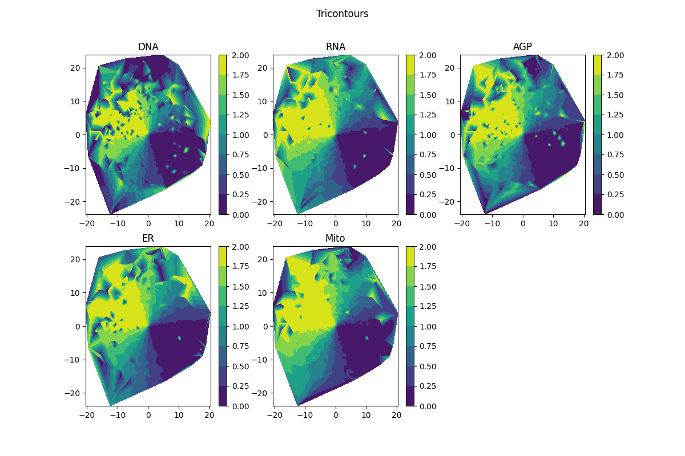

# BBBC037 - Posamezen kanal je povprečen

|    |       DNA |       RNA |       AGP |        ER |      Mito |      base | Metric                                     |
|---:|----------:|----------:|----------:|----------:|----------:|----------:|:-------------------------------------------|
|  0 | 24.5481   | 24.6871   | 23.8811   | 22.836    | 23.4712   | 25.5773   | Average folds of enrichment at top 1%      |
|  1 |  0.134804 |  0.156863 |  0.120098 |  0.14951  |  0.134804 |  0.137255 | Average of Precision At Top 1% (9 results) |
|  2 |  0.166555 |  0.163778 |  0.183905 |  0.170744 |  0.173777 |  0.180324 | Average Recall At Top 10% (20 results)     |
|  3 |  0.175771 |  0.16771  |  0.174396 |  0.167253 |  0.169126 |  0.181242 | Mean Average Precision (MAP)               |
|  4 |  0.175362 |  0.167292 |  0.17404  |  0.166836 |  0.168749 |  0.18084  | Area Under the PR curve                    |
